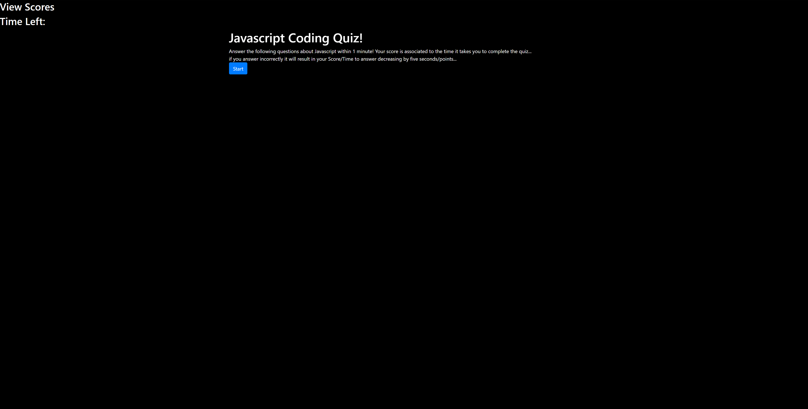

# CodeQuiz
Homework #4
## Description
This is a Javascript quiz designed to test your basic knowledge of the language and made using Javascript dynamic DOM manipulation.

## Table of Contents

* [Usage](#Usage)
* [Credits](#Credits)

## Usage

```
GIVEN I am taking a code quiz
WHEN I click the start button
THEN a timer starts and I am presented with a question
WHEN I answer a question
THEN I am presented with another question
WHEN I answer a question incorrectly
THEN time is subtracted from the clock
WHEN all questions are answered or the timer reaches 0
THEN the game is over
WHEN the game is over
THEN I can save my initials and score
```




## Credits
Logan Sage //sagelogan
